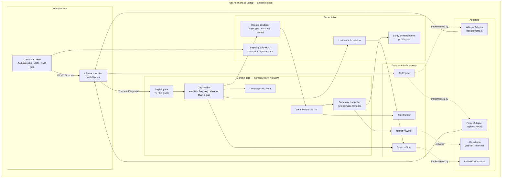
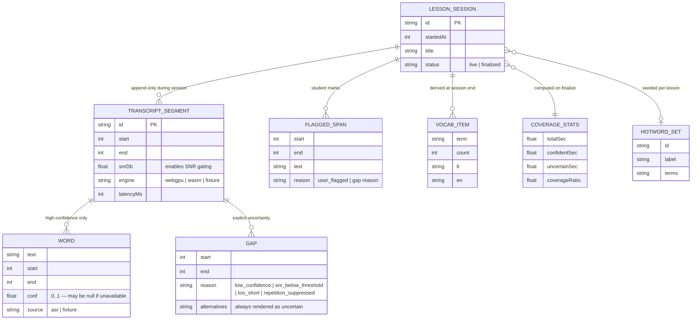
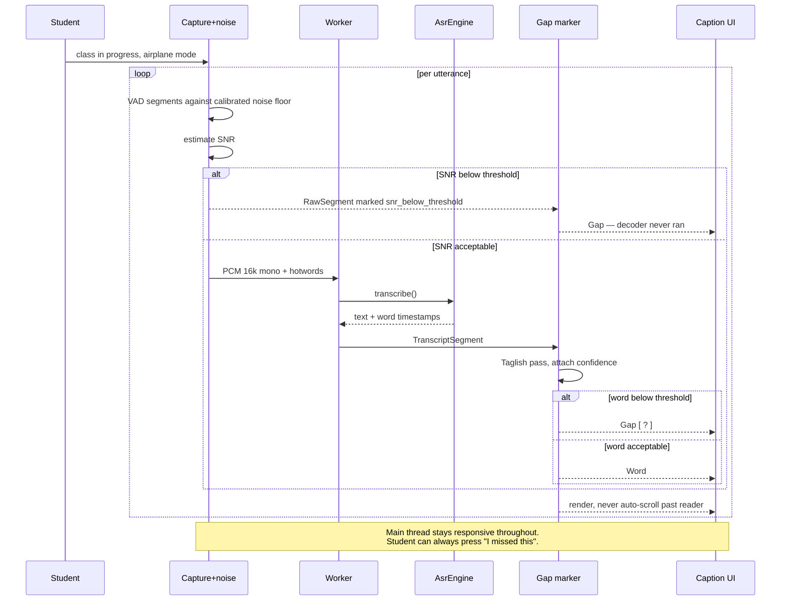
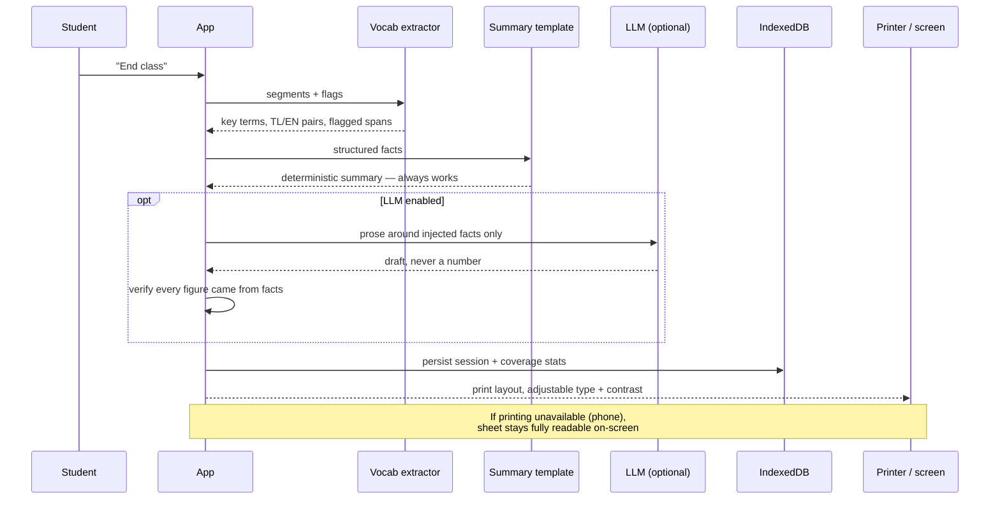
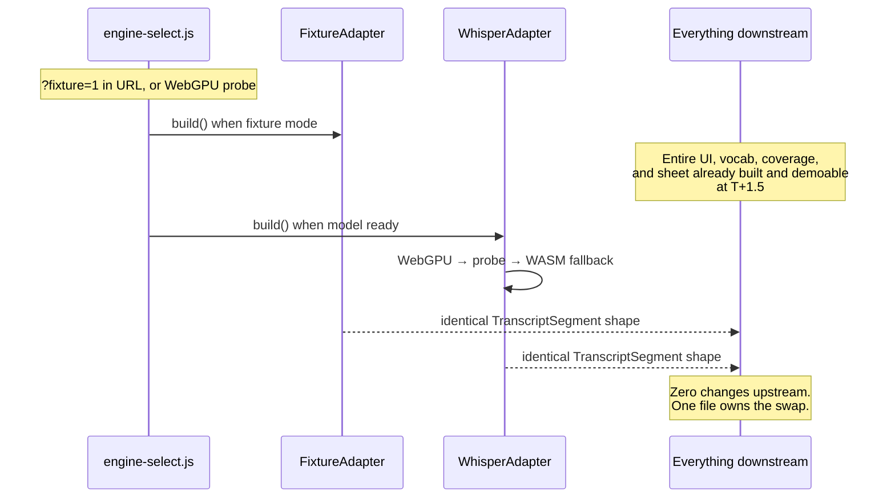

# Boses — System Architecture

Companion to `Boses.md` (product spec) and `docs/coordination.md` (coordination).
Read this before T+0:30, because **one decision here unblocks the whole team's build.**

---

## 0. The finding that shapes everything else

I verified `transformers.js` against its current source rather than assuming. Two results:

**Confirmed — word-level timestamps work.** `return_timestamps: 'word'` is a supported parameter of the ASR pipeline, and it maps internally to `return_token_timestamps: true`. Chained decoding via `chunk_length_s` / `stride_length_s` also works as documented. The live-caption spine is buildable.

**Not confirmed — per-word confidence is not exposed.** The pipeline's documented output is:

```
{ text: string, chunks: [{ timestamp: [number, number], text: string }] }
```

**There is no confidence field.** Neither `Chunk` nor `AutomaticSpeechRecognitionOutput` carries per-token probability.

This matters more than any other technical risk in this project, because **the product's core promise is "a confident wrong caption is worse than a visible gap"** — and that promise is implemented entirely on per-word confidence. Right now the confidence signal we need exists inside the model but is not handed to us by the API we planned to use.

Logits *are* reachable — `model.generate()` returns them, and `outputs.logits.slice(null, -1, null).to('float32')` plus the library's own `softmax` utility gives you probabilities. But that means dropping below the stable pipeline API into model internals, which is where version churn and breakage live.

**This is decision ADR-0002, and it has a deadline: T+3.** Not T+17. If confidence cannot be sourced by T+3, the gap-marking design changes shape and the whole team needs to know before they build on it.

---

## 1. Context summary

**What it is.** A PWA that captions a Filipino classroom lesson in Taglish, entirely on-device, and ends with a printable study sheet for a deaf or hard-of-hearing student.

**Confirmed constraints** (from the brief and the product spec):

| Constraint | Value |
| --- | --- |
| Build window | **19.5 hours**, 2:30 PM Oct 9 → 10:00 AM Oct 10 code freeze |
| Team | 1–4 people; the build plan assumes 4 |
| Theme | Local AI — meaningful inference must run on-device |
| Devices | **Phone and laptop only.** Two ends of the affordability range |
| Deployment | PWA, no store, no account, no login |
| Network | Airplane-mode-only after first load; one-time model download is the sole dependency |
| Data sensitivity | Student disability status, children's voices, classroom speech. Data Privacy Act of 2012 |
| Submission | Public repo, one submission, no edits after |

**Explicitly NOT supplied — flagged as assumptions, not invented:**

| Unknown | Assumption used | Resolve by |
| --- | --- | --- |
| Target model size | `whisper-tiny` / `whisper-base` quantized, chosen by device probe | **T+3** |
| Latency budget | Not asserted. Measured and published | T+17 |
| Audio sample rate | 16 kHz mono (Whisper's native rate) | confirmed by library docs |
| Classroom SNR | 5–15 dB typical; **measure your own room** | T+0.5 |

I have not invented throughput numbers, user counts, or SLAs anywhere in this document. Where a number is needed, it is marked as *measure and publish*.

---

## 2. Architecture overview

**Shape: hexagonal (ports and adapters) in the browser.** Not because it is fashionable, but because of one hard requirement — the four-person team must be able to work in parallel without waiting on each other, and the single riskiest component (the ASR model) is the slowest and most failure-prone thing in the build.

The port/adapter boundary at the inference engine is what makes that possible. Everything downstream of `AsrEngine` is built against a contract. The real model and a fixture-replay stub are interchangeable adapters.



**The dependency rule, stated once:** arrows point inward. `core/` imports nothing from `adapters/`, `web/`, or any library. The capture and worker code know about `AsrEngine`; they do not know about Whisper.

---

## 3. Component detail

### 3.1 Capture + noise (`capture.js`, `noise.js`) — P2

**Responsibility.** Own the microphone, produce normalized PCM, and decide *whether a segment is worth transcribing at all.*

This component is more important than its line count suggests, because it is where the noise problem is won or lost. Spec section 7 Step 0.

**Interface.**

```ts
interface CaptureSource {
  start(): Promise<void>;
  onSegment(cb: (seg: RawSegment) => void): void;
  stop(): Promise<void>;
  signalQuality(): QualitySnapshot;   // drives the HUD
}

interface RawSegment {
  pcm: Float32Array;      // mono, 16 kHz
  startSec: number;
  endSec: number;
  snrDb: number;          // computed against calibrated room floor
  reason?: GapReason['kind'];  // set if gating rejected this segment
}
```

**Scaling / failure behavior.** Stateless per segment. Rolling noise-floor minimum adapts across a session. If `snrDb` falls below threshold the decoder is **never invoked** — the segment is handed downstream already marked as a gap. This is the single highest value-per-line-of-code decision in the system.

### 3.2 Inference worker (`asr-worker.js`) — P1

**Responsibility.** Run the model off the main thread and emit `TranscriptSegment`s.

**Why a Worker is not optional.** Whisper inference on WASM will block for hundreds of milliseconds per utterance. On the main thread that freezes the caption UI, the "I missed this" button, and the signal HUD — i.e. it freezes the exact interactions the student has during a lesson. The Worker keeps the UI responsive at all times, which is a **product requirement**, not a performance nicety.

**Why it also makes the team parallel.** A worker is a message boundary. It is also the natural place to hang the engine adapter swap.

### 3.3 `AsrEngine` port and its two adapters — P1

**Responsibility.** The port is the contract; the adapters are interchangeable.

```ts
interface AsrEngine {
  readonly id: EngineId;
  readonly supportsWordConfidence: boolean;  // ← see ADR-0002, currently false
  init(onProgress?: (p: number) => void): Promise<void>;
  transcribe(seg: RawSegment, opts: TranscribeOptions): Promise<TranscriptSegment>;
  dispose(): Promise<void>;
}
```

**`WhisperAdapter`** — real model, `device: 'webgpu'`, falls back to `'wasm'`.

**`FixtureAdapter`** — replays committed JSON. Instant, deterministic, offline. This is what the other three people build against for the first 15 hours.

The `supportsWordConfidence` flag exists so the gap marker can degrade honestly instead of pretending. When confidence is unavailable, the gap marker must not silently emit confident-looking captions — that would be the exact failure the product was built to prevent.

### 3.4 Gap marker (`confidence.js`, `gaps`) — P4

**Responsibility.** Convert a raw transcript plus an uncertainty estimate into `words[]` and `gaps[]`.

This is the soul of the product. It is the one module where "be conservative" is more valuable than "be accurate," because the user cannot audit our output.

**Design rule, enforced in code:** *there is no code path that produces a `Word` without a confidence value or a provenance of `unknown`.* If confidence is missing, the output is a `Gap`, not a word.

### 3.5 Taglish pass (`taglish.js`) — P4

**Responsibility.** Tag spans TL / EN / MIX. Rule-based, lexicon-driven, inspectable.

**Critical invariant:** a sentence that stays Taglish when the teacher spoke Taglish is **correct behavior** and must never be "corrected" into English. This is the single easiest place to introduce a bug that looks like a feature.

### 3.6 Presentation (`captions.js`, `sheet.js`) — P3

Caption renderer, flag capture, study sheet, HUD. Builds entirely against `FixtureAdapter`. The renderer must treat `gaps` as first-class renderable content — a gap is a thing to *show*, styled deliberately, not a string to be interpolated.

### 3.7 Storage (`store.js`, IndexedDB) — P4

Per-device session persistence with one-tap permanent deletion.

**Requirement that is easy to miss:** segments must be checkpointed to IndexedDB **as they arrive**, not at end of class. A phone that dies at minute 18 of a 20-minute lesson must not lose the lesson. Offline-first trades server redundancy for local privacy, and this is where you claw some of it back.

---

## 4. Data model

The contracts frozen at T+0:30. `gaps` and `snrDb` are load-bearing, not decoration.



**Two modeling decisions worth defending:**

**`WORD.conf` is nullable.** This looks like a weakness. It is not. If the confidence API doesn't materialize (ADR-0002), a non-null field would force us to invent a number — and inventing a confidence is the precise failure mode the product exists to prevent. Nullable makes the degradation explicit.

**`GAP.reason` is an enum, not free text.** It forces every uncertainty to be attributable. A gap you cannot explain is a bug.

---

## 5. Key flows

### Flow A — Live captioning (the spine)



### Flow B — End of class → printable sheet



### Flow C — Engine swap (why the architecture pays off)



---

## 6. Failure and scaling analysis

**On scaling.** This product has no throughput dimension to scale. It is single-user, single-device, and explicitly has no server. Stating that plainly is more useful than inventing a scaling story. What it has instead is a **capability ceiling**: a phone's thermal budget and RAM bound model size, which bounds accuracy. The honest framing for judges is that local-first trades unbounded scale for zero marginal cost, zero latency-to-privacy, and zero egress.

**Device capability tiers** — the real scaling axis:

| Tier | Device | Model | Expected behavior |
| --- | --- | --- | --- |
| A | Recent laptop | `whisper-base`, WebGPU | Reference path. Latency comfortable |
| B | Mid-range Android | `whisper-tiny` or base, WebGPU if present | Expected demo path on a phone |
| C | Older phone | `whisper-tiny`, **WASM** | Works, slower. Coverage figure drops — which is the honest signal |

**Failure modes, in the order they will actually happen:**

| # | Failure | Detection | Response | Blast radius |
| --- | --- | --- | --- | --- |
| 1 | **No confidence available** (ADR-0002) | Probe at T+3 | Fall back to the ladder in ADR-0002; else gap-mark on SNR alone | **Design-level.** Touches the core promise — decide early |
| 2 | WebGPU absent | Feature probe at init | WASM path, pre-warmed | Latency only. Covered |
| 3 | Model download incomplete | Progress callback stalls | Fixture mode + explicit UI warning | Demo only, if pre-downloaded |
| 4 | **Hallucination loop on noise** | Repetition detector | Suppress, emit `repetition_suppressed` gap | One segment. Contained by design |
| 5 | Phone thermal throttling | `latencyMs` climbing | Shrink model, warn, suggest pausing | Latency. Coverage drops honestly |
| 6 | **Phone battery dies mid-class** | `visibilitychange` / power events | Segments checkpointed to IndexedDB as they arrive | Partial lesson recoverable — **only because of incremental writes** |
| 7 | Backgrounded tab throttles timers | `document.hidden` | Warn "keep this screen open" | Timer drift. Detection is cheap |
| 8 | IndexedDB quota exceeded | Quota error on write | Drop audio blobs, keep text; tell the user | Text survives, audio lost |
| 9 | Mic permission denied | `getUserMedia` rejection | Clear in-app explanation, no silent dead UI | Total, but visibly |
| 10 | Low-end device OOM | Worker crash | Restart with smaller model, tell the user | Session text survives |

**Timeout budgets.** The capture worker should hand off to the ASR worker immediately. The ASR worker should have a **per-segment timeout of 2× the measured p95 latency**; exceeding it emits a gap rather than blocking the caption stream forever. A stalled decoder that never returns is worse than an admitted gap.

**The blast-radius principle, stated once:** any single failure must degrade into *a visible gap*, never into *a silent wrong caption*. That is the same principle as the product itself, applied to engineering.

---

## 7. Architecture Decision Records

### ADR-0001 — Hexagonal core with adapter ports

**Status:** Accepted · **Decide by:** T+0:30

**Context.** Four people, 19.5 hours, one dominant risk (the model may not work until hour 8).

**Decision.** Domain core with no framework or DOM imports. Inference, storage, vocabulary ranking, and narrative writing are all ports.

**Alternatives.** Direct `transformers.js` calls throughout — rejected: every module then depends on the model working, so the whole team serializes behind the riskiest component. Framework-agnostic "just organize files nicely" — rejected: provides no enforcement, and nothing stops an import creeping inward.

**Consequences.** ~1 hour of upfront interface definition buys three people full-day parallelism. Cost: indirection, and discipline to keep `core/` clean.

### ADR-0002 — How to source per-word confidence

**Status:** **OPEN — decide by T+3** · *This is the highest-risk decision in the project.*

**Context.** Verified: the ASR pipeline returns `{text, chunks[{timestamp, text}]}` with **no confidence field**. Confidence is required for gap marking, and gap marking is the product's core promise. Separately, noise can make model confidence *rise*, which would defeat the promise even if confidence existed.

**Decision — a ladder, cheapest first. Stop at the first rung that works:**

1. **Probe for an exposed confidence path** — check whether the current build surfaces per-token scores or a no-speech probability. *Cheapest. Try at T+3.*
2. **Drop below the pipeline** — call `model.generate()` directly, read `outputs.logits`, softmax per token, align tokens to word chunks. *Feasible per the source, but inside model internals where breakage lives.*
3. **Segment-level proxy** — derive a per-segment reliability from measurable acoustic features (SNR, duration, VAD quality) rather than model confidence. Weaker, but it is honest and it cannot lie in the way unexamined model confidence can.
4. **SNR-gated certainty** — treat only segments above a strict SNR threshold as reliable, and mark everything else as a gap.

**Consequences.** Rungs 1–2 give the strongest result and require P1's time. Rung 3 is achievable by P4 with no model internals. Rung 4 is always available as the floor.

**Trigger to revisit.** If rung 2 is not working by **T+5**, take rung 3 and stop trying. Do not let the core promise wait on a research spike.

**Honest note.** Rungs 3 and 4 weaken the headline claim. The disclosure sheet and the demo must state which rung shipped. Do not describe a rung-3 gap mark as "model confidence."

### ADR-0003 — PWA, not native

**Status:** Accepted · **Decide by:** T+0:30

**Decision.** One codebase, installable, no store account.

**Alternatives.** Native Android — rejected: store account, review, two codebases, and it defeats "runs on whatever the school owns." Desktop-only — rejected: excludes the cheapest and most common device, which is the phone.

**Consequences.** Store install friction is real but acceptable; the capability ceiling is the phone's.

### ADR-0004 — Inference in a Web Worker

**Status:** Accepted · **Decide by:** T+1

**Decision.** All model calls off the main thread.

**Alternatives.** Main thread — rejected: a WASM inference stall freezes the caption UI and the flag button, i.e. the student's only controls during the lesson. That is a product failure, not a performance one.

**Consequences.** Serialization cost at the boundary; a worker restart path must be implemented and tested.

### ADR-0005 — Gaps as first-class data

**Status:** Accepted · **Decide by:** T+0:30

**Decision.** Uncertainty is modeled in `TranscriptSegment`, not rendered by the UI.

**Alternatives.** Render gaps in the view — rejected: the printer and the vocabulary extractor would both silently invent their own gap logic, and would disagree with the screen. This is the mistake that produces a confident-wrong caption.

**Consequences.** One place decides what counts as unknown. That place is auditable.

### ADR-0006 — Utterance-level streaming, not token streaming

**Status:** Accepted · **Decide by:** T+2

**Decision.** Decode per VAD utterance via `chunk_length_s`, with per-segment timeout.

**Alternatives.** Token-by-token streaming — rejected for the prototype: alignment complexity is high and Whisper's own decode is not naturally incremental. Full-lesson batch — rejected: produces nothing until the end, which defeats live captions.

**Consequences.** Captions arrive a beat after a sentence. The honest requirement is *"before the teacher moves to the next point"* — not sub-second. Do not over-promise.

### ADR-0007 — Local storage only, no server, no sync

**Status:** Accepted · **Decide by:** T+0:30

**Decision.** IndexedDB per device. No account, no sync, no cross-device transfer.

**Consequences.** Zero egress is architectural rather than promised. Device loss is a real risk — mitigated by incremental checkpointing, stated honestly, never papered over. **Phone and laptop sessions do not sync; say so plainly rather than letting it look like an oversight.**

### ADR-0008 — Deterministic summary as the baseline, LLM strictly optional

**Status:** Accepted · **Decide by:** T+7.5 (cut #1)

**Decision.** The summary template always works. The local LLM writes prose only, around injected facts, and is cut first.

**Consequences.** The artifact survives total LLM failure. In a rescue-adjacent context a hallucinated figure is a serious harm, so numbers are never generated — only injected.

---

## 8. Open questions

| # | Question | Trigger that resolves it | Default if unresolved |
| --- | --- | --- | --- |
| 1 | Which confidence rung ships? | P1 probe completes, **T+3** (T+5 hard stop) | Rung 3 — segment-level proxy |
| 2 | `whisper-tiny` or `whisper-base`? | Fits-and-measures on the actual demo device, **T+3** | `tiny` on phone, `base` on laptop |
| 3 | Does WebGPU exist on the demo phone? | Feature probe on the real device, **T+4** | WASM path, pre-warmed |
| 4 | Is Taglish span-tagging worth it? | Measured effect on WER, **T+7.5** | Keep recognition, drop labelling |
| 5 | Does hotword biasing measurably help Taglish? | Before/after WER, **T+7.5** | Cut it — cut #2 |
| 6 | Can the phone sustain a full lesson thermally? | Run one real lesson on the phone, **T+12** | Shrink model; report coverage honestly |
| 7 | Are word timestamps accurate enough on Taglish? | Compare against gold transcript, **T+8** | Coarser segments; gaps get wider |

**Question 1 is the one that matters.** Everything else is a tuning decision. If confidence cannot be sourced, the product still works and still keeps its honesty — but the demo narrative shifts from *"the model knows when it is unsure"* to *"the system knows when the room is too noisy to trust."* That is a weaker but still defensible claim, and it must be stated accurately rather than papered over.

---

## 9. T+0.5 checklist

- [ ] `contracts.ts` committed and frozen — including the **nullable** `conf`
- [ ] `engine-select.js` committed with both adapters stubbed
- [ ] Fixture JSON committed (clean + noisy + taglish) — existence matters more than quality
- [ ] P1 starts the **confidence probe** now; it gates T+3
- [ ] Everyone agrees the phone is the design target, not an afterthought

---

## 10. Wires into the build plan

This document does not replace `docs/coordination.md`; it supplies its contracts.

| Build-plan lane | Architectural source |
| --- | --- |
| P1 — ASR / models | ADR-0002 (the ladder), ADR-0004 (worker), ADR-0006 (utterance streaming) |
| P2 — Audio / noise | Section 3.1 capture contract, SNR gating in section 6 |
| P3 — UI / print / integration | Section 3.6, and Flow C for why the swap is one file |
| P4 — Taglish / eval / submission | Section 3.4 gap marker, section 4 data model, section 14 of `Boses.md` |

**The one sentence that justifies this document:** at T+1.5, three of the four people should be able to demo a working caption loop against fixtures, while the fourth is still fighting WebGPU. If that is not true on the night, the architecture is wrong.

---

## 11. Final alignment notes

The wall poster stands unchanged:

```
CONTRACTS FROZEN AT T+0:30.
NEVER WAIT FOR A PERSON — ONLY FOR A FILE.
NOBODY EDITS ANOTHER PERSON'S DIRECTORY.
main MUST ALWAYS RUN IN AIRPLANE MODE.
GAP MARKING  +  SNR GATE  +  "I MISSED THIS"  +  PRINTABLE SHEET  =  NON-NEGOTIABLE.
CUTS AT CHECKPOINT B (T7.5), NOT AT T17.
TEST ON PHONE + LAPTOP BEFORE THE REHEARSAL.
SUBMIT EARLY. CODE FREEZES AT T19.5.
```

Two standing obligations carry through from the spec: **phone is the design target, not an afterthought** (ADR-0003), and **nothing invents a number it cannot source** (ADR-0008, and the nullable `conf` in section 4). If the build is running late, the honest gap beats the confident caption, every time.